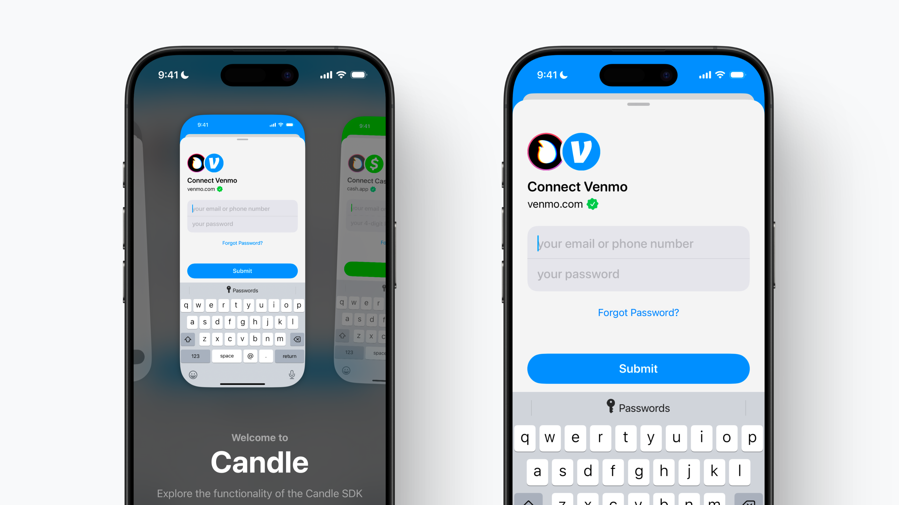

# Candle Swift SDK
  
[Website](https://www.candle.fi) | [Documentation](https://docs.candle.fi)

#### Supported Platforms

<picture>
  <source media="(prefers-color-scheme: dark)" srcset="Images/ios.svg">
  <source media="(prefers-color-scheme: light)" srcset="Images/ios-active.svg">
  
</picture>&nbsp;

<picture>
  <source media="(prefers-color-scheme: dark)" srcset="Images/ipados.svg">
  <source media="(prefers-color-scheme: light)" srcset="Images/ipados-active.svg">
  
</picture>&nbsp;

---

The Candle Swift SDK is a simple & secure way for developers to connect external services to LLMs, agents, and apps. Visit our [quick start](https://docs.candle.fi/quick-start) guide to get started.

